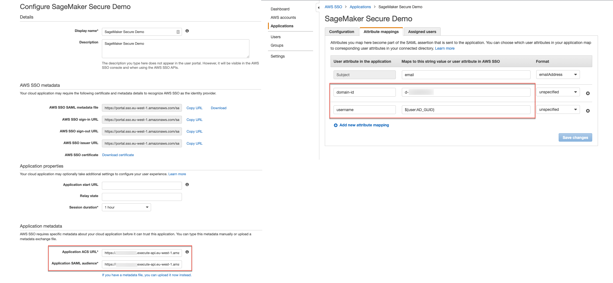

# amazon-sagemaker-studio-secure-sso

This solution provides a way to deploy SageMaker Studio in a private and secure environment. The solution integrates with a [Custom SAML 2.0 Application](https://docs.aws.amazon.com/singlesignon/latest/userguide/samlapps.html) as a mechanism to trigger the authentication to SageMaker Studio. The Custom SAML application needs to be configured with the API Gateway endpoint URL as its ACS and needs mapping attributes containing the AWS SSO User ID as well as the SageMaker Domain Domain ID. 
The deployment procedure assumes that [AWS Single Sign On](https://docs.aws.amazon.com/singlesignon/latest/userguide/what-is.html) has been enabled and configured for the [AWS Organization](https://docs.aws.amazon.com/organizations/latest/userguide/orgs_introduction.html) the solution will deployed in.

The workflow of deployment is as followed:

- Retrieve the AWS SSO User ID - can be done through the console or using the following command
```sh
aws identitystore list-users --identity-store-id '<Identity Store ID>' --filter AttributePath='UserName',AttributeValue='user@company.com'
```
- Build and deploy the SAM Application with the following command
```sh
sam build && sam deploy --capabilities CAPABILITY_NAMED_IAM CAPABILITY_AUTO_EXPAND --guided
```
- Set the parameter **UserProfileName** to the User ID retreived in the first step
- Go to the AWS SSO Console and create a new [Custom SAML 2.0 Application](https://docs.aws.amazon.com/singlesignon/latest/userguide/samlapps.html)
- Set the Application ACS URL to the URL provided in the **SAMLBackEndApi** Key SAM Output
- Save the application and re-open then go under Attribute mappings
- Set the Subject to **email** and format **emailAddress**
- Add a new attribute named **domain-id** and set the value to the Key SAM Output **SageMakerStudioDomainId**
- Add a new attribute named **username** and set the value to **${user:AD_GUID}**





The template also deploys 3 EC2 instances for demonstrating the solution. 

- 1 EC2 Windows in a private subnet that is able to access SageMaker
- 1 EC2 Linux in the public subnet acting as Bastion host used to establish an SSH tunnel into the EC2 Windows on the private network
- 1 EC2 Windows in a public subnet to demonstrate that SageMaker Studio can't be accessed from unauthorised subnets - IP Available as the **SageMakerWindowsBastionHost** Key SAM Output

Note that the password for the Windows EC2 instances is provided in the output under the **SageMakerWindowsPassword** key value. To change it, run the following command in a Windows Command prompt at the first login.

```sh
net user Administrator "NewPassword"
```

To access the EC2 Windows on the private network, run the command provided as the value of the SAM output Key **TunnelCommand** and establish an RDP connection on localhost and port 3389. Make sure that the public key of the KeyPair specified in the parameter is the directory where the SSH tunnel command is run from.

Once logged in the the EC2 Windows, connect to the AWS SSO portal using the username and password associated with the User ID that was specified as the **UserProfileName** parameter.

In order to prevent access to SageMaker Studio for users within the console we recommend to implement the following [Service Control Policy](https://docs.aws.amazon.com/organizations/latest/userguide/orgs_manage_policies_scps.html). Make sure to replace the ***<AuthorizedPrivateSubnet>*** with the source IP CDIR block you want to allow SageMaker Studio access from.

```sh
{
  "Version": "2012-10-17",
  "Statement": [
    {
      "Action": [
        "sagemaker:*"
      ],
      "Resource": "*",
      "Effect": "Allow"
    },
    {
      "Condition": {
        "NotIpAddress": {
          "aws:VpcSourceIp": "<AuthorizedPrivateSubnet>"
        }
      },
      "Action": [
        "sagemaker:CreatePresignedDomainUrl"
      ],
      "Resource": "*",
      "Effect": "Deny"
    }
  ]
}
```