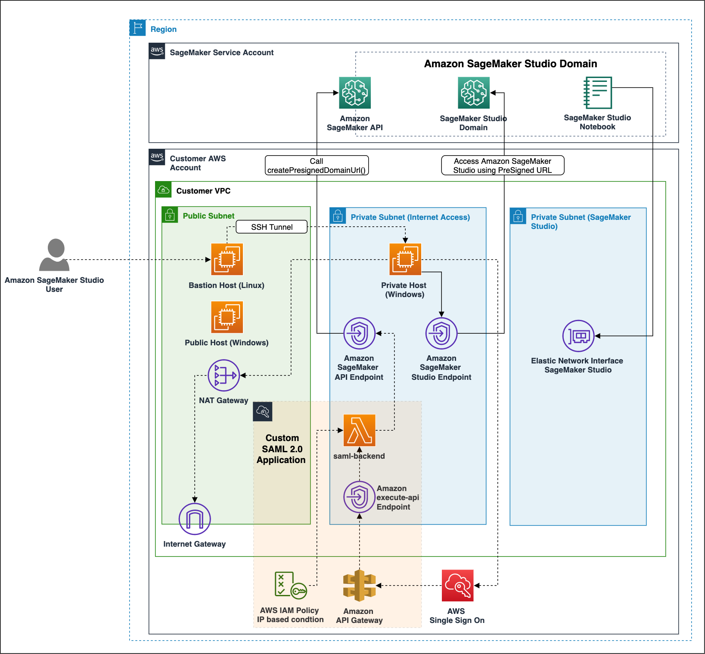
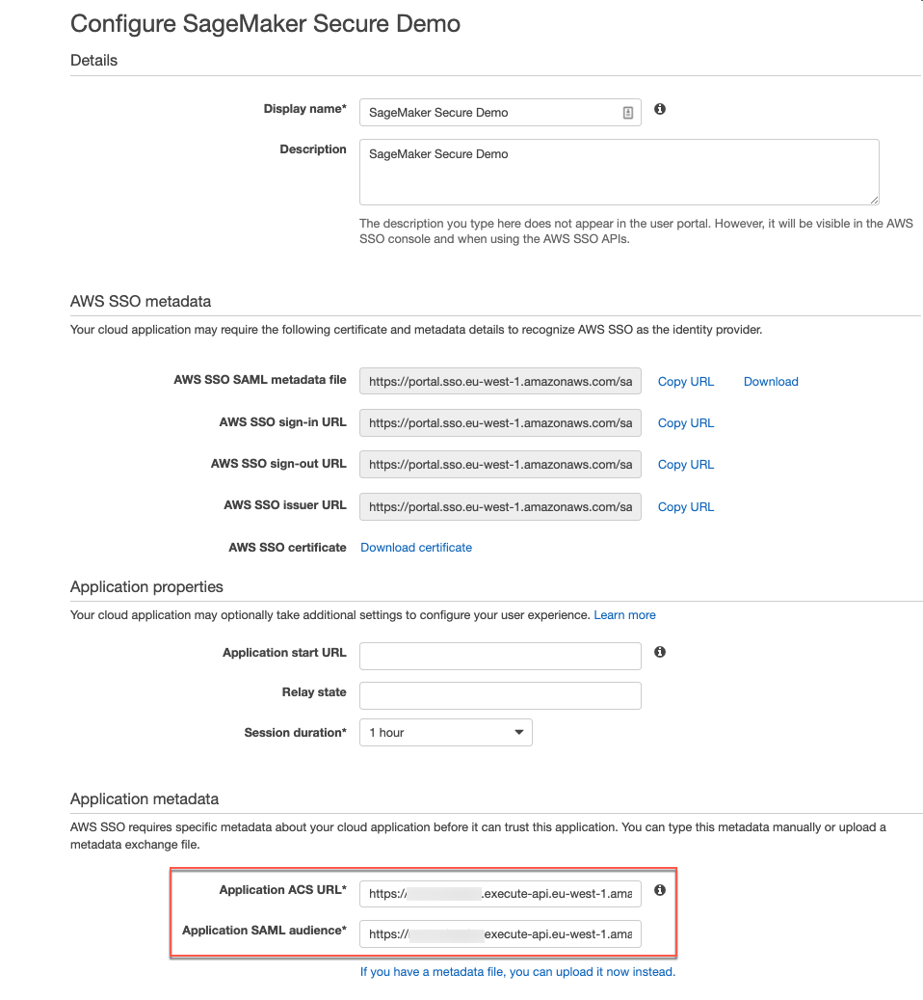
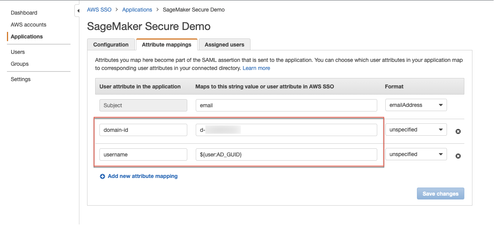
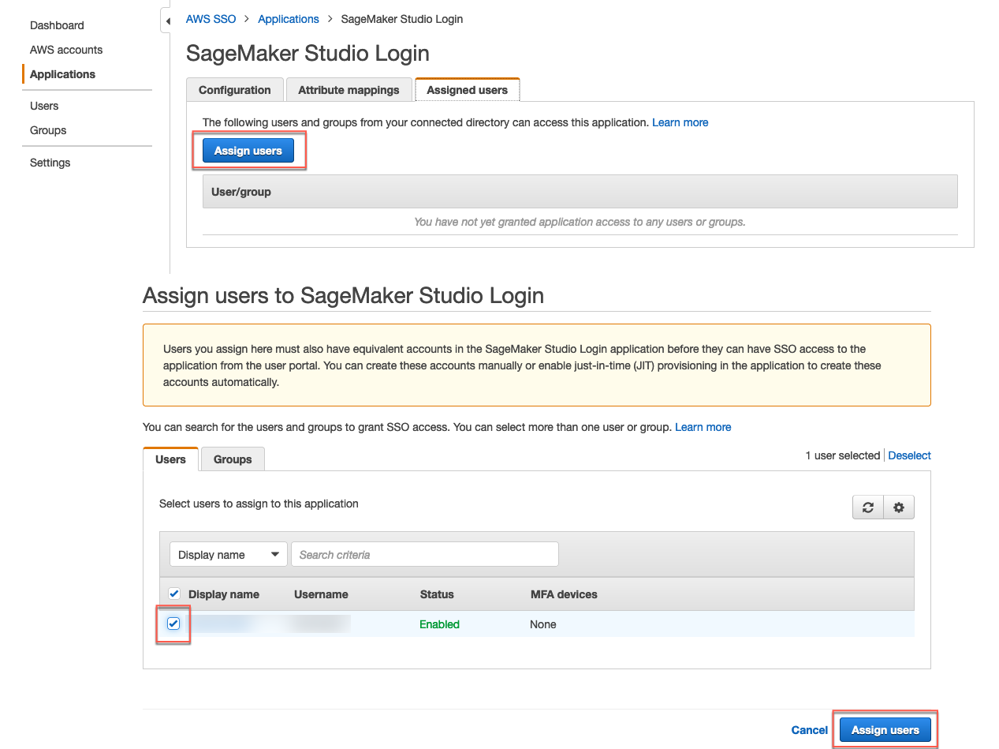
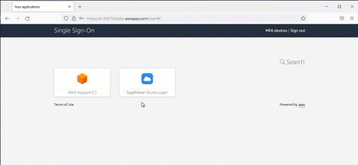
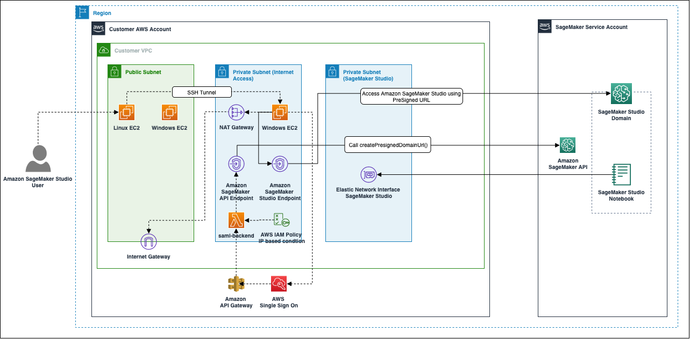
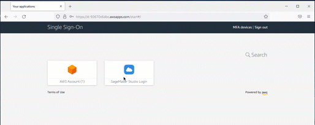

# amazon-sagemaker-studio-secure-sso

## Architecture of the solution

This solution provides a way to deploy SageMaker Studio in a private and secure environment. The solution integrates with a [Custom SAML 2.0 Application](https://docs.aws.amazon.com/singlesignon/latest/userguide/samlapps.html) as the mechanism to trigger the authentication to Amazon SageMaker Studio. It requires that the Custom SAML application is configured with the Amazon API Gateway endpoint URL as its ACS (Assertion Consumer Service) and needs mapping attributes containing the AWS SSO User ID as well as the Amazon SageMaker Domain Domain ID. 
The Amazon API Gateway is configured to trigger an AWS Lambda function that parses the SAML response to extract the Domain ID and User ID and use it to generate the SageMaker Studio Presigned URL and eventually perform redirection to log the user in Amazon SageMaker Studio. The control of the environment that SageMaker Studio users are able to login from is done by an AWS IAM Policy that includes a condition to allow the generation of the predefined URL only from specific(s) IPs, which is attached to the AWS Lambda function.
The Amazon SageMaker Studio Domain creates an Amazon EFS mount where some user specific data Amazon SageMaker Studio Domain is persisted, note that the automated deletion process of this project will also delete the Amazon EFS mount and its content.



## Prerequisites

[AWS CLI](https://docs.aws.amazon.com/cli/latest/userguide/cli-chap-getting-started.html), [AWS SAM CLI](https://docs.aws.amazon.com/serverless-application-model/latest/developerguide/serverless-sam-cli-install.html) and [python3.8 or later](https://www.python.org/downloads/) must be installed.

The deployment procedure assumes that [AWS Single Sign On](https://docs.aws.amazon.com/singlesignon/latest/userguide/what-is.html) has been enabled and configured for the [AWS Organization](https://docs.aws.amazon.com/organizations/latest/userguide/orgs_introduction.html) where the solution will be deployed.

You can follow these [instructions](./aws-sso-setup.md) to setup AWS Single Sign On.

## Deploy the Amazon Sagemaker Studio Secure with AWS Single Sign On solution

1. Run the following commands to build and deploy the SAM Application. Replace the ```<Identity Store ID>``` ([where to find the Identity Store ID](./aws-sso-setup.md#retreive-identity-store-id)) and ```<UserName>``` with values from your AWS SSO configuration.
```sh
ssoStoreId='<Identity Store ID>'
ssoUserName='<UserName>'
publicIp=$(curl -s 'https://api.ipify.org?format=text')/32
ssoUserId=$(aws identitystore list-users --identity-store-id $ssoStoreId --filter AttributePath='UserName',AttributeValue=$ssoUserName --query 'Users[0].UserId' --output text)
EC2keyPair=$(aws ec2 create-key-pair --key-name $ssoUserName-key --query 'KeyMaterial' --output text >> $ssoUserName-key.pem && chmod 400 $ssoUserName-key.pem)
sam build && sam deploy --capabilities CAPABILITY_NAMED_IAM CAPABILITY_AUTO_EXPAND --stack-name sagemaker-secure-sso --guided --parameter-overrides KeyPairName=$ssoUserName-key SSOUserId=$ssoUserId PublicIpCidr=$publicIp
```
2. Once the SAM application is fully deployed, the output should look something like this: 
```sh
CloudFormation outputs from deployed stack
----------------------------------------------------------------------------------------------------------------------------------------------------------------------------------------------------------------
Outputs                                                                                                                                                                                                        
----------------------------------------------------------------------------------------------------------------------------------------------------------------------------------------------------------------
Key                 SageMakerWindowsBastionHost                                                                                                                                                                
Description         Public IP Address to access Windows Bastion Host                                                                                                                                           
Value               34.245.126.112                                                                                                                                                                             

Key                 SageMakerWindowsPassword                                                                                                                                                                   
Description         Default password to loging to the EC2 Windows instances                                                                                                                                    
Value               SageMakerSecureSSO10.100.0.0/16                                                                                                                                                            

Key                 SAMLAudience                                                                                                                                            
Description         Application SAML audience                                                                                                                               
Value               https://dl06u6zwx1.execute-api.eu-west-1.amazonaws.com/       

Key                 SAMLBackEndApi                                                                                                                                                                             
Description         API Gateway endpoint URL acting as the Application ACS URL                                                                                                                                 
Value               https://dl06u6zwx1.execute-api.eu-west-1.amazonaws.com/prod/saml                                                                                                                           

Key                 SageMakerStudioDomainId                                                                                                                                                                    
Description         SageMaker Studio domain created                                                                                                                                                            
Value               d-qd5xcbgwf2cs                                                                                                                                                                             

Key                 TunnelCommand                                                                                                                                                                              
Description         Command to initiate the SSH tunnnel in order to access the Windows EC2 on the private subnet over RDP                                                                                      
Value               ssh -i sso-username.pem -A -N -L localhost:3389:10.100.10.187:3389 ec2-user@3.250.93.113                                                                                            
----------------------------------------------------------------------------------------------------------------------------------------------------------------------------------------------------------------
``` 

3. Create a new [Custom SAML 2.0 Application](https://docs.aws.amazon.com/singlesignon/latest/userguide/samlapps.html)
  * Open the [AWS SSO console](https://console.aws.amazon.com/singlesignon) on the AWS management account
  * Choose **Applications**
  * Click **Add a new application**
  * Choose **Add a custom SAML 2.0 application**
  * Name the Custom SAML 2.0 Application ```SageMaker Secure Demo```
  * Leave **Application start URL** and **Relay state** empty
  * Click **If you don't have a metadata file, you can manually type your metadata values.**
  * Set the **Application ACS URL** to the URL provided in the **SAMLBackEndApi** Key SAM Output
  * Set the **Application SAML audience** to the URL provided in the **SAMLAudience** Key SAM Output
  * Click **Save Changes**

  

4. Go to the **Attribute mappings** tab
  * Set the Subject to **email** and format **emailAddress**
  * Add a new attribute named **domain-id** and set the value to the Key SAM Output **SageMakerStudioDomainId**
  * Add a new attribute named **username** and set the value to **${user:AD_GUID}**



5. Go to the **Assigned users** tab
  * Click **Assign users**
  * Select the user used in the **ssoUserName** variable of the SAM deployment steps
  * Click **Assign users**
 


## How to test the solution

The solution deploys 3 EC2 instances for demonstrating the solution. 

* 1 EC2 Windows in a private subnet that is able to access Amazon SageMaker Studio (think your onpremise secured environment)
* 1 EC2 Linux in the public subnet acting as Bastion host used to establish an SSH tunnel into the EC2 Windows on the private network
* 1 EC2 Windows in a public subnet to demonstrate that SageMaker Studio can't be accessed from unauthorised subnets - IP Available as the **SageMakerWindowsBastionHost** Key SAM Output 

The username to login to the Windows EC2 instances is **Administrator** and the password is provided in the output under the **SageMakerWindowsPassword** key value. Follow [these instructions](https://docs.aws.amazon.com/AWSEC2/latest/WindowsGuide/connecting_to_windows_instance.html) to connect to the EC2 Windows instance.

To change the password, run the following command in a Windows Command prompt at the first login:

```batch
net user Administrator "NewPassword"
```

### Test the access to Amazon SageMaker Studio from authorised network

1. To access the EC2 Windows on the private network, run the command provided as the value of the SAM output Key **TunnelCommand**, make sure that the public key of the KeyPair specified in the parameter is the directory where the SSH tunnel command is run from (by default the root of the project folder). The command opens an [SSH tunnel](https://www.ssh.com/academy/ssh/tunneling/example) from the local computer on localhost:3389 to the EC2 Windows Instance on the private network.
  &nbsp;
    * **Full command example**
      * ```ssh -i sso-username.pem -A -N -L localhost:3389:10.100.10.187:3389 ec2-user@3.250.93.113```
&nbsp;
    * **Command structure explained**
      * ```ssh``` : SSH command
      * ```-i sso-username.pem``` : Pass the private key for authentication: 
      * ```-A```  : Enable agent forwarding for autentication on the remote host
      * ```-N``` : No Execution of remote command as we are just doing forwarding
      * ```-L localhost:3389:10.100.10.187:3389 ec2-user@3.250.93.113``` : Performs the forward of the localhost (local machine) on port 3389 to the private EC2 Windows (10.100.10.187) also on port 3389 by goin through the EC2 Linux on the public subnet (3.250.93.113)
&nbsp;

1.  On your local desktop/notebook open a new RDP connection (for example using [Microsoft Remote Desktop](https://www.microsoft.com/en-us/p/microsoft-remote-desktop/9wzdncrfj3ps?activetab=pivot:overviewtab)) using localhost as the host, This connection will be tunnelled via the bastion host to the private EC2 Windows instance. Use the user name “Administrator” and password from the stack output **SageMakerWindowsPassword**.
2.  Open the Firefox web browser from the Desktop 
3.  Navigate and login to the AWS Single Sign On portal using the credentials associated with the User ID that was specified as the **SSOUserId** parameter.
4. Click the ```SageMaker Secure Demo``` SSO Application from the AWS Single Sign On portal

**Expected Result**: User is logged in to Amazon SageMaker Studio



### Test to Access Amazon SageMaker Studio from unauthorised network

1. Open a new RDP connection on the IP provided in the **SageMakerWindowsBastionHost** SAML output and port 3389, 
2. Open the Firefox web browser from the Desktop
3. Navigate and login to the AWS Single Sign On portal using the credentials associated with the User ID that was specified as the **SSOUserId** parameter.
4. Click the ```SageMaker Secure Demo``` SSO Application from the AWS Single Sign On portal
# amazon-sagemaker-studio-secure-sso

## Architecture of the solution

This solution provides a way to deploy SageMaker Studio in a private and secure environment. The solution integrates with a [Custom SAML 2.0 Application](https://docs.aws.amazon.com/singlesignon/latest/userguide/samlapps.html) as the mechanism to trigger the authentication to Amazon SageMaker Studio. It requires that the Custom SAML application is configured with the Amazon API Gateway endpoint URL as its ACS (Assertion Consumer Service) and needs mapping attributes containing the AWS SSO User ID as well as the Amazon SageMaker Domain Domain ID. 
The Amazon API Gateway is configured to trigger an AWS Lambda function that parses the SAML response to extract the Domain ID and User ID and use it to generate the SageMaker Studio Presigned URL and eventually perform redirection to log the user in Amazon SageMaker Studio. The control of the environment that SageMaker Studio users are able to login from is done by an AWS IAM Policy that includes a condition to allow the generation of the predefined URL only from specific(s) IPs, which is attached to the AWS Lambda function.
The Amazon SageMaker Studio Domain creates an Amazon EFS mount where some user specific data Amazon SageMaker Studio Domain is persisted, note that the automated deletion process of this project will also delete the Amazon EFS mount and its content.



## Prerequisites

[AWS CLI](https://docs.aws.amazon.com/cli/latest/userguide/cli-chap-getting-started.html), [AWS SAM CLI](https://docs.aws.amazon.com/serverless-application-model/latest/developerguide/serverless-sam-cli-install.html) and [python3.8 or later](https://www.python.org/downloads/) must be installed.

The deployment procedure assumes that [AWS Single Sign On](https://docs.aws.amazon.com/singlesignon/latest/userguide/what-is.html) has been enabled and configured for the [AWS Organization](https://docs.aws.amazon.com/organizations/latest/userguide/orgs_introduction.html) where the solution will be deployed.

You can follow these [instructions](./aws-sso-setup.md) to setup AWS Single Sign On.

## Deploy the Amazon Sagemaker Studio Secure with AWS Single Sign On solution

1. Run the following commands to build and deploy the SAM Application. Replace the ```'<Identity Store ID>'``` ([retreive the Store ID](./aws-sso-setup.md#retreive-identity-store-id)) and ```'<UserName>'``` with values from your AWS SSO configuration.
```sh
ssoStoreId='<Identity Store ID>'
ssoUserName='<UserName>'
publicIp=$(curl -s 'https://api.ipify.org?format=text')/32
ssoUserId=$(aws identitystore list-users --identity-store-id $ssoStoreId --filter AttributePath='UserName',AttributeValue=$ssoUserName --query 'Users[0].UserId' --output text)
EC2keyPair=$(aws ec2 create-key-pair --key-name $ssoUserName-key --query 'KeyMaterial' --output text >> $ssoUserName-key.pem && chmod 400 $ssoUserName-key.pem)
sam build && sam deploy --capabilities CAPABILITY_NAMED_IAM CAPABILITY_AUTO_EXPAND --stack-name sagemaker-secure-sso --guided --parameter-overrides KeyPairName=$ssoUserName-key SSOUserId=$ssoUserId PublicIpCidr=$publicIp
```
2. Once the SAM application is fully deployed, the output should look something like this: 
```sh
CloudFormation outputs from deployed stack
----------------------------------------------------------------------------------------------------------------------------------------------------------------------------------------------------------------
Outputs                                                                                                                                                                                                        
----------------------------------------------------------------------------------------------------------------------------------------------------------------------------------------------------------------
Key                 SageMakerWindowsBastionHost                                                                                                                                                                
Description         Public IP Address to access Windows Bastion Host                                                                                                                                           
Value               34.245.126.112                                                                                                                                                                             

Key                 SageMakerWindowsPassword                                                                                                                                                                   
Description         Default password to loging to the EC2 Windows instances                                                                                                                                    
Value               SageMakerSecureSSO10.100.0.0/16                                                                                                                                                            

Key                 SAMLBackEndApi                                                                                                                                                                             
Description         API Gateway endpoint URL acting as the Application ACS URL                                                                                                                                 
Value               https://dl06u6zwx1.execute-api.eu-west-1.amazonaws.com/prod/saml                                                                                                                           

Key                 SageMakerStudioDomainId                                                                                                                                                                    
Description         SageMaker Studio domain created                                                                                                                                                            
Value               d-qd5xcbgwf2cs                                                                                                                                                                             

Key                 TunnelCommand                                                                                                                                                                              
Description         Command to initiate the SSH tunnnel in order to access the Windows EC2 on the private subnet over RDP                                                                                      
Value               ssh -i sso-username.pem -A -N -L localhost:3389:10.100.10.187:3389 ec2-user@3.250.93.113                                                                                            
----------------------------------------------------------------------------------------------------------------------------------------------------------------------------------------------------------------
``` 

3. Create a new [Custom SAML 2.0 Application](https://docs.aws.amazon.com/singlesignon/latest/userguide/samlapps.html)
  * Open the [AWS SSO console](https://console.aws.amazon.com/singlesignon) on the AWS management account
  * Choose **Applications**
  * Click **Add a new application**
  * Choose **Add a custom SAML 2.0 application**
  * Name the Custom SAML 2.0 Application ```SageMaker Secure Demo```
  * Leave **Application start URL** and **Relay state** empty
  * Click **If you don't have a metadata file, you can manually type your metadata values.**
  * Set the **Application ACS URL** to the URL provided in the **SAMLBackEndApi** Key SAM Output
  * Set the **Application SAML audience** to the URL provided in the **SAMLAudience** Key SAM Output
  * Click **Save Changes**

  

4. Go under the **Attribute mappings** tab
  * Set the Subject to **email** and format **emailAddress**
  * Add a new attribute named **domain-id** and set the value to the Key SAM Output **SageMakerStudioDomainId**
  * Add a new attribute named **username** and set the value to **${user:AD_GUID}**


5. Go under the **Assigned users** tab
  * Click **Assign users**
  * Select the user used in the **ssoUserName** variable of the SAM deployment steps
  * Click **Assign users**
 


## How to test the solution

The solution deploys 3 EC2 instances for demonstrating the solution. 

* 1 EC2 Windows in a private subnet that is able to access Amazon SageMaker Studio (think your onpremise secured environment)
* 1 EC2 Linux in the public subnet acting as Bastion host used to establish an SSH tunnel into the EC2 Windows on the private network
* 1 EC2 Windows in a public subnet to demonstrate that SageMaker Studio can't be accessed from unauthorised subnets - IP Available as the **SageMakerWindowsBastionHost** Key SAM Output 

The username to login to the Windows EC2 instances is **Administrator** and the password is provided in the output under the **SageMakerWindowsPassword** key value. Follow [these instructions](https://docs.aws.amazon.com/AWSEC2/latest/WindowsGuide/connecting_to_windows_instance.html) to connect to the EC2 Windows instance.

To change the password, run the following command in a Windows Command prompt at the first login:

```batch
net user Administrator "NewPassword"
```

### Test to Access Amazon SageMaker Studio from authorised network

1. To access the EC2 Windows on the private network, run the command provided as the value of the SAM output Key **TunnelCommand**, make sure that the public key of the KeyPair specified in the parameter is the directory where the SSH tunnel command is run from. The command creates an [SSH tunnel](https://www.ssh.com/academy/ssh/tunneling/example) from the local computer on localhost:3389 to the EC2 Windows Instance on the private network. 

    **Full command example**
    * ```ssh -i sso-username.pem -A -N -L localhost:3389:10.100.10.187:3389 ec2-user@3.250.93.113```

    **Command structure explained**
    * ```ssh``` : SSH command
    * ```-i sso-username.pem``` : Pass the private key for authentication: 
    * ```-A```  : Enable agent forwarding for autentication on the remote host
    * ```-N``` : No Execution of remote command as we are just doing forwarding
    * ```-L localhost:3389:10.100.10.187:3389 ec2-user@3.250.93.113``` : Performs the forward of the localhost (local machine) on port 3389 to the private EC2 Windows (10.100.10.187) also on port 3389 by goin through the EC2 Linux on the public subnet (3.250.93.113)


2.  On your local desktop/notebook open a new RDP connection (for example using [Microsoft Remote Desktop](https://www.microsoft.com/en-us/p/microsoft-remote-desktop/9wzdncrfj3ps?activetab=pivot:overviewtab)) using localhost as the host, This connection will be tunnelled via the bastion host to the private EC2 windows instance. Use the user name “Administrator” and password from the stack output **SageMakerWindowsPassword**.
3.  Open the Firefox web browser from the Desktop 
4.  Navigate and login to the AWS Single Sign On portal using the credentials associated with the User ID that was specified as the **SSOUserId** parameter.
5. Click the ```SageMaker Secure Demo``` SSO Application from the AWS Single Sign On portal

**Expected Result**: User is logged in to Amazon SageMaker Studio


### Test the access to Amazon SageMaker Studio from unauthorised network

1. Open a new RDP connection on the IP provided in the **SageMakerWindowsBastionHost** SAML output and port 3389, 
2. Open the Firefox web browser from the Desktop
3. Navigate and login to the AWS Single Sign On portal using the credentials associated with the User ID that was specified as the **SSOUserId** parameter.
4. Click the ```SageMaker Secure Demo``` SSO Application from the AWS Single Sign On portal

**Expected Result**: User receives an unauthorized access message



### Prevent Access to Amazon SageMaker Studio from the AWS Console

In order to centrally prevent access to SageMaker Studio for users within the console we recommend to implement the following [Service Control Policy](https://docs.aws.amazon.com/organizations/latest/userguide/orgs_manage_policies_scps.html) and attach it to the account where SageMaker Studio is or can be deployed. 
Make sure to replace the **\<AuthorizedPrivateSubnet\>** with the source IP CDIR block you want to allow SageMaker Studio access from.

```json
{
  "Version": "2012-10-17",
  "Statement": [
    {
      "Action": [
        "sagemaker:*"
      ],
      "Resource": "*",
      "Effect": "Allow"
    },
    {
      "Condition": {
        "NotIpAddress": {
          "aws:VpcSourceIp": "<AuthorizedPrivateSubnet>"
        }
      },
      "Action": [
        "sagemaker:CreatePresignedDomainUrl"
      ],
      "Resource": "*",
      "Effect": "Deny"
    }
  ]
}
```

## Cleanup

To delete the solution application that you created, use the AWS CLI. Assuming you used the default project name for the stack name, you can run the following:

```bash
sam delete delete-stack --stack-name sagemaker-secure-sso
aws ec2 delete-key-pair --key-name $ssoUserName-key > /dev/null
```

:warning: The Amazon EFS mount and the content associated with the Amazon SageMaker Studio Domain deployed in this project will be deleted. :warning:

### How to delete the Custom SAML application

1. Open the [AWS SSO console](https://console.aws.amazon.com/singlesignon).
2. Choose **Applications**
3. Select the radio button next to **SageMaker Studio Login**
4. Go to **Actions** and select **Remove**
5. Type in the **SageMaker Studio Login** in the field and cliclk **Remove application**
**Expected Result**: User receives an unauthorized access message


### Prevent Access to Amazon SageMaker Studio from the AWS Console

In order to centrally prevent access to SageMaker Studio for users within the console we recommend to implement the following [Service Control Policy](https://docs.aws.amazon.com/organizations/latest/userguide/orgs_manage_policies_scps.html) and attach it to the account where SageMaker Studio is or can be deployed. 
Make sure to replace the **<AuthorizedPrivateSubnet>** with the source IP CDIR block you want to allow SageMaker Studio access from.

```json
{
  "Version": "2012-10-17",
  "Statement": [
    {
      "Action": [
        "sagemaker:*"
      ],
      "Resource": "*",
      "Effect": "Allow"
    },
    {
      "Condition": {
        "NotIpAddress": {
          "aws:VpcSourceIp": "<AuthorizedPrivateSubnet>"
        }
      },
      "Action": [
        "sagemaker:CreatePresignedDomainUrl"
      ],
      "Resource": "*",
      "Effect": "Deny"
    }
  ]
}
```

## Cleanup

To delete the solution application that you created, use the follwing commands CLI. Assuming you used the default project name for the stack name, you can run the following:

```bash
sam delete delete-stack --stack-name sagemaker-secure-sso
aws ec2 delete-key-pair --key-name $ssoUserName-key > /dev/null
```

:warning: The Amazon EFS mount and the content associated with the Amazon SageMaker Studio Domain deployed in this project will be deleted. :warning:

### How to delete the Custom SAML application

1. Open the [AWS SSO console](https://console.aws.amazon.com/singlesignon).
2. Choose **Applications**
3. Select the radio button next to **SageMaker Studio Login**
4. Go to **Actions** and select **Remove**
5. Type in the **SageMaker Studio Login** in the field and cliclk **Remove application**